-- SELECT подзапросы

-- 1. Простой подзапрос в SELECT
```sql
SELECT name, 
       (SELECT COUNT(*) FROM commander WHERE commander.allianceid = alliance.id) as commander_count
FROM alliance;
```

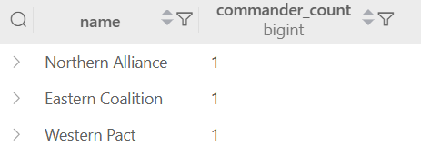

-- 2. Подзапрос в SELECT с вычислением
```sql
SELECT name,
       (SELECT AVG(LENGTH(name)) FROM state WHERE state.allianceid = alliance.id) as avg_state_name_length
FROM alliance;
```

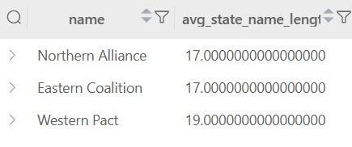

-- 3. Подзапрос в SELECT с агрегатной функцией
```sql
SELECT name,
       (SELECT MAX(startdate) FROM war WHERE war.treatyid = treaty.id) as latest_war_start
FROM treaty;
```

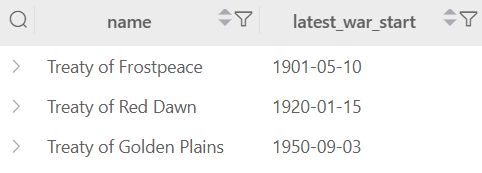

-- FROM подзапросы

-- 1. Подзапрос в FROM с группировкой
```sql
SELECT alliance_name, war_count
FROM (SELECT alliance.name as alliance_name, COUNT(war.id) as war_count
      FROM alliance
      LEFT JOIN state ON alliance.id = state.allianceid
      LEFT JOIN war ON war.id IN (SELECT warid FROM event WHERE event.warid = war.id)
      GROUP BY alliance.name) as alliance_war_stats;
```

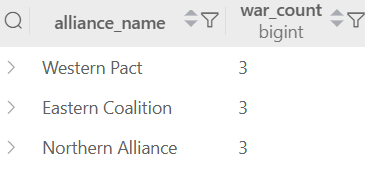

-- 2. Подзапрос в FROM с фильтрацией
```sql
SELECT leader_name, dynasty_name
FROM (SELECT leader.name as leader_name, dynasty.name as dynasty_name
      FROM leader
      JOIN dynasty ON leader.dynastyid = dynasty.id
      WHERE leader.birthdate > '1880-01-01') as modern_leaders;
```

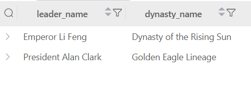

-- 3. Подзапрос в FROM с вычислениями
```sql
SELECT state_name, city_count
FROM (SELECT state.name as state_name, 
             (SELECT COUNT(*) FROM city WHERE city.stateid = state.id) as city_count
      FROM state) as state_city_stats;
```

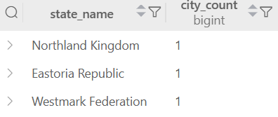

-- WHERE подзапросы

-- 1. Подзапрос в WHERE с сравнением
```sql
SELECT name FROM state
WHERE allianceid = (SELECT id FROM alliance WHERE name = 'Northern Alliance');
```


-- 2. Подзапрос в WHERE с агрегатной функцией
```sql
SELECT name FROM war
WHERE startdate > (SELECT AVG(startdate) FROM war);
```


-- 3. Подзапрос в WHERE с датами
```sql
SELECT name FROM leader
WHERE birthdate < (SELECT MIN(startdate) FROM war WHERE war.id IN (SELECT warid FROM event));
```


-- HAVING подзапросы

-- 1. HAVING с подзапросом
```sql
SELECT allianceid, COUNT(*) as state_count
FROM state
GROUP BY allianceid
HAVING COUNT(*) > (SELECT AVG(state_count) 
                   FROM (SELECT allianceid, COUNT(*) as state_count 
                         FROM state GROUP BY allianceid) as avg_stats);
```


-- 2. HAVING с коррелированным подзапросом
```sql
SELECT dynastyid, COUNT(*) as leader_count
FROM leader
GROUP BY dynastyid
HAVING COUNT(*) >= (SELECT COUNT(*) FROM war 
                    WHERE war.id IN (SELECT warid FROM event 
                                   WHERE event.id IN (SELECT event_id FROM event_alliance 
                                                    WHERE alliance_id IN (SELECT allianceid FROM state 
                                                                        WHERE state.id IN (SELECT stateid FROM leader 
                                                                                         WHERE leader.dynastyid = dynasty.id)))));
```

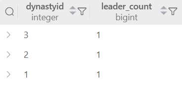

-- 3. HAVING с подзапросом и агрегацией
```sql
SELECT warid, COUNT(*) as event_count
FROM event
GROUP BY warid
HAVING COUNT(*) > (SELECT AVG(event_count) 
                   FROM (SELECT warid, COUNT(*) as event_count 
                         FROM event GROUP BY warid) as war_events);
```


-- ALL подзапросы

-- 1. ALL с сравнением
```sql
SELECT name FROM war
WHERE enddate > ALL (SELECT startdate FROM war WHERE name LIKE '%War%');
```

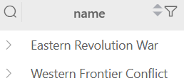

-- 2. ALL с датами
```sql
SELECT name FROM leader
WHERE birthdate > ALL (SELECT startdate FROM war WHERE treatyid IN (SELECT id FROM treaty WHERE name LIKE '%Golden%'));
```


-- 3. ALL с агрегацией
```sql
SELECT name FROM state
WHERE LENGTH(name) > ALL (SELECT AVG(LENGTH(name)) FROM city GROUP BY stateid);
```

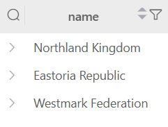

-- IN подзапросы

-- 1. IN с простым подзапросом
```sql
SELECT name FROM commander
WHERE allianceid IN (SELECT id FROM alliance WHERE name LIKE '%Alliance%');
```


-- 2. IN с множественными условиями
```sql
SELECT name FROM event
WHERE warid IN (SELECT id FROM war 
                WHERE treatyid IN (SELECT id FROM treaty 
                                 WHERE name LIKE '%Treaty%'));
```

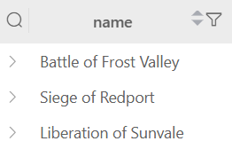

-- 3. IN с соединением таблиц
```sql
SELECT name FROM city
WHERE stateid IN (SELECT id FROM state 
                  WHERE allianceid IN (SELECT id FROM alliance 
                                     WHERE name IN ('Northern Alliance', 'Eastern Coalition')));
```


-- ANY подзапросы

-- 1. ANY с сравнением
```sql
SELECT name FROM state
WHERE LENGTH(name) > ANY (SELECT LENGTH(name) FROM city WHERE city.stateid = state.id);
```

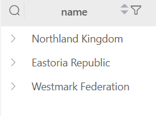

-- 2. ANY с датами
```sql
SELECT name FROM war
WHERE startdate < ANY (SELECT birthdate FROM leader 
                       WHERE leader.stateid IN (SELECT id FROM state 
                                              WHERE state.allianceid IN (SELECT alliance_id FROM event_alliance 
                                                                       WHERE event_alliance.event_id IN (SELECT id FROM event 
                                                                                                      WHERE event.warid = war.id))));
```


-- 3. ANY с агрегацией
```sql
SELECT name FROM dynasty
WHERE LENGTH(foundername) > ANY (SELECT AVG(LENGTH(name)) FROM commander 
                                 WHERE commander.allianceid IN (SELECT allianceid FROM state 
                                                              WHERE state.id IN (SELECT stateid FROM leader 
                                                                               WHERE leader.dynastyid = dynasty.id)));
```


-- EXISTS подзапросы

-- 1. EXISTS с корреляцией
```sql
SELECT name FROM alliance a
WHERE EXISTS (SELECT 1 FROM state s 
              WHERE s.allianceid = a.id AND s.ideology = 'Monarchy');
```


-- 2. EXISTS с вложенными подзапросами
```sql
SELECT name FROM treaty t
WHERE EXISTS (SELECT 1 FROM war w 
              WHERE w.treatyid = t.id 
                AND EXISTS (SELECT 1 FROM event e 
                           WHERE e.warid = w.id 
                             AND EXISTS (SELECT 1 FROM event_source es 
                                        WHERE es.event_id = e.id)));
```

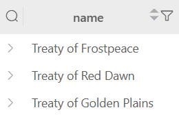

-- 3. EXISTS с множественными условиями
```sql
SELECT name FROM source s
WHERE EXISTS (SELECT 1 FROM event_source es 
              WHERE es.source_id = s.id 
                AND EXISTS (SELECT 1 FROM event e 
                           WHERE e.id = es.event_id 
                             AND EXISTS (SELECT 1 FROM war w 
                                        WHERE w.id = e.warid 
                                          AND w.startdate > '1920-01-01')));
```

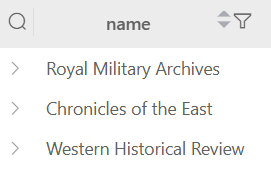

-- Сравнение по нескольким столбцам

-- 1. Сравнение по двум столбцам
```sql
SELECT name FROM leader l1
WHERE (birthdate, deathdate) IN (SELECT birthdate, deathdate 
                                 FROM leader l2 
                                 WHERE l2.id != l1.id AND l2.dynastyid = l1.dynastyid);
```


-- 2. Сравнение по нескольким столбцам с агрегацией
```sql
SELECT name FROM state s1
WHERE (allianceid, LENGTH(name)) IN (SELECT allianceid, MAX(LENGTH(name)) 
                                     FROM state s2 
                                     WHERE s2.allianceid = s1.allianceid 
                                     GROUP BY allianceid);
```


-- 3. Сравнение по датам и идентификаторам
```sql
SELECT name FROM war w1
WHERE (startdate, treatyid) IN (SELECT startdate, treatyid 
                                FROM war w2 
                                WHERE w2.id != w1.id 
                                  AND EXTRACT(YEAR FROM w2.startdate) = EXTRACT(YEAR FROM w1.startdate));
```


-- Коррелированные подзапросы

-- 1. Коррелированный подзапрос в SELECT
```sql
SELECT name,
       (SELECT COUNT(*) FROM event e WHERE e.warid = w.id) as event_count
FROM war w;
```

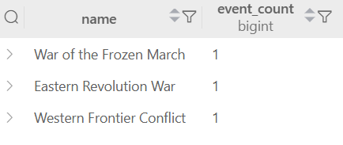

-- 2. Коррелированный подзапрос в WHERE
```sql
SELECT name FROM state s
WHERE (SELECT COUNT(*) FROM city c WHERE c.stateid = s.id) > 1;
```


-- 3. Коррелированный подзапрос с агрегацией
```sql
SELECT name FROM alliance a
WHERE (SELECT AVG(LENGTH(name)) FROM state s WHERE s.allianceid = a.id) > 10;
```

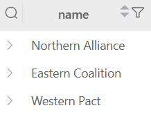

-- 4. Коррелированный подзапрос с датами
```sql
SELECT name FROM leader l
WHERE birthdate < (SELECT MIN(startdate) FROM war w 
                   WHERE w.id IN (SELECT warid FROM event e 
                                WHERE e.id IN (SELECT event_id FROM event_alliance ea 
                                             WHERE ea.alliance_id IN (SELECT allianceid FROM state s 
                                                                    WHERE s.id = l.stateid))));
```


-- 5. Сложный коррелированный подзапрос
```sql
SELECT name FROM dynasty d
WHERE (SELECT COUNT(*) FROM leader l 
       WHERE l.dynastyid = d.id 
         AND l.birthdate > (SELECT AVG(startdate) FROM war w 
                          WHERE w.id IN (SELECT warid FROM event e 
                                       WHERE e.id IN (SELECT event_id FROM event_alliance ea 
                                                    WHERE ea.alliance_id IN (SELECT allianceid FROM state s 
                                                                           WHERE s.id = l.stateid))))) > 0;
```

